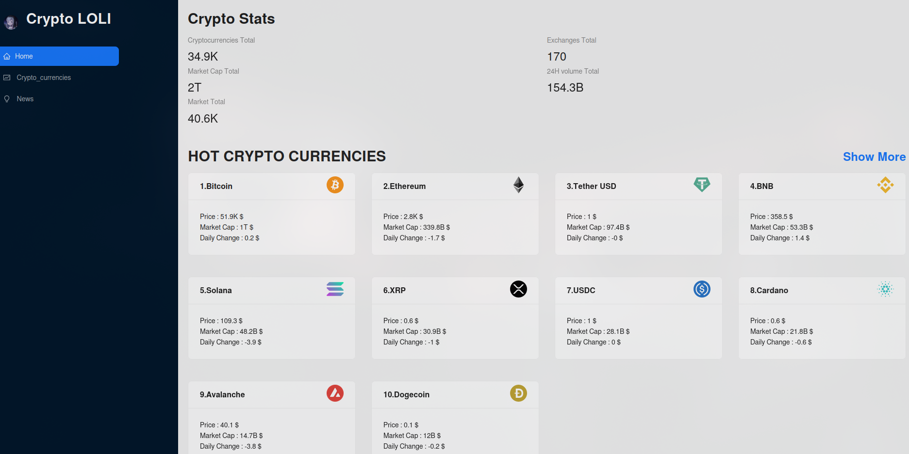

# Crypto Lolis

Crypto Lolis is a comprehensive cryptocurrency tracking application that provides real-time news, rankings, prices, and market values of various cryptocurrencies. It also provides detailed information about each cryptocurrency. The application is built using React for the frontend, Redux for state management, and Ant Design library for UI components. It fetches data from a cryptocurrency API provided by RapidAPI.

## Features

- Real-time cryptocurrency news
- Rankings of cryptocurrencies
- Current prices of cryptocurrencies
- Market values of cryptocurrencies
- Detailed information about each cryptocurrency

## Technologies Used
React.js
Redux
Ant Design
RapidAPI